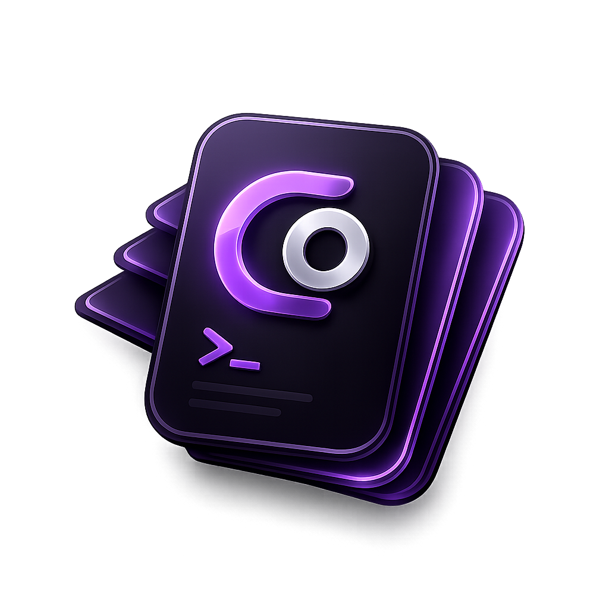

# CardOps

> A 'gamified' way to store your CLI commands, manage them, AND get them in your clipboard ! 

## Overview

This project was created to address a specific operational need and make it fun to use. 

Whether you're looking to use it directly, adapt it to your own environment, or contribute improvements, feedback and contributions are welcome.

## Features

* Offline only - no data sent to any cloud. 
* Basic HTML/JS/CSS app made to work on any computer , only requires any browser
* Uses INDEXEDB for data persistence: unless you clear everything (including the cache of your browser) you won't lose your data. 
* Download the Project, put it wherever you need, start it with index.html, and start playng around ! 
* default templates for commonly used commands available
* Ease of import/export: create (or use the templates) decks, imports them in the interface directly ! 
* Deck Builder to make the json formatting easier: open booster-pack-creator.html, create your card deck, export it to json, and import it into cardops ! 

## Disclaimer

I'm a systems administrator, not a professional software developer.
Most of the codebase was created with the assistance of modern AI coding tools and then reviewed, tested, and adapted to fit the project's requirements. While every effort has been made to ensure the project works reliably, there may be implementation choices that differ from what an experienced software engineer would produce.

If you spot issues, improvements, or better approaches, pull requests and constructive feedback are greatly appreciated, and i am open to discuss things ! 
This project is mainly an idea that I created thanks to AI tools and that i am happy to share, but it can still evolve / be better ! 

## Status

This project is actively maintained as time permits and is primarily developed to solve practical operational needs.

## Roadmap/Future Ideas

*Operation Decks: transform your procedures into card hands, play them with tutorial like explanation, step by step.
*PWA conversion 
*Mobile compatible app conversion
